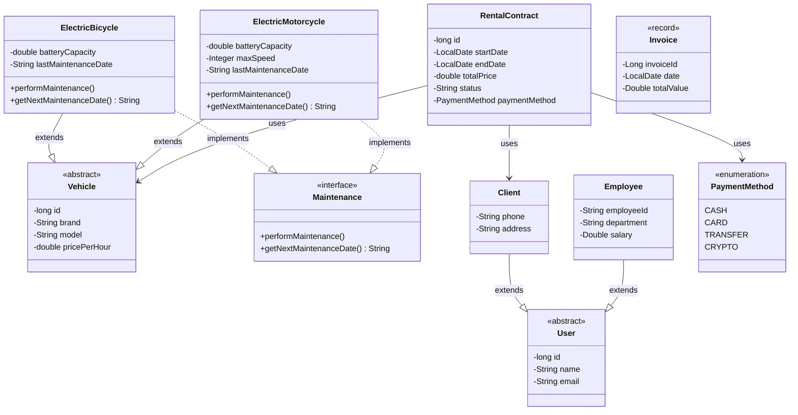

# Diagrama de Clases - Transport System

```mermaid
classDiagram
    %% Abstract Classes
    class User {
        <<abstract>>
        -long id
        -String name
        -String email
    }

    class Vehicle {
        <<abstract>>
        -long id
        -String brand
        -String model
        -double pricePerHour
    }

    %% Interfaces
    class Maintenance {
        <<interface>>
        +performMaintenance()
        +getNextMaintenanceDate() String
    }

    %% Concrete Classes
    class Client {
        -String phone
        -String address
    }

    class Employee {
        -String employeeId
        -String department
        -Double salary
    }

    class ElectricBicycle {
        -double batteryCapacity
        -String lastMaintenanceDate
        +performMaintenance()
        +getNextMaintenanceDate() String
    }

    class ElectricMotorcycle {
        -double batteryCapacity
        -Integer maxSpeed
        -String lastMaintenanceDate
        +performMaintenance()
        +getNextMaintenanceDate() String
    }

    class RentalContract {
        -long id
        -LocalDate startDate
        -LocalDate endDate
        -double totalPrice
        -String status
        -PaymentMethod paymentMethod
    }

    %% Enums
    class PaymentMethod {
        <<enumeration>>
        CASH
        CARD
        TRANSFER
        CRYPTO
    }

    %% Records
    class Invoice {
        <<record>>
        -Long invoiceId
        -LocalDate date
        -Double totalValue
    }

    %% Relationships
    Client --|> User : extends
    Employee --|> User : extends
    ElectricBicycle --|> Vehicle : extends
    ElectricMotorcycle --|> Vehicle : extends
    ElectricBicycle ..|> Maintenance : implements
    ElectricMotorcycle ..|> Maintenance : implements
    RentalContract --> Vehicle : uses
    RentalContract --> Client : uses
    RentalContract --> PaymentMethod : uses
```
